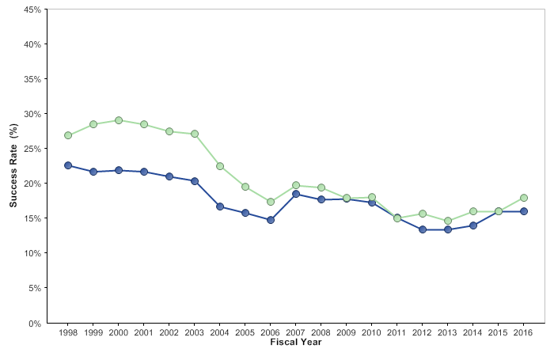
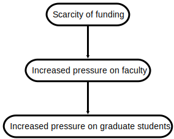
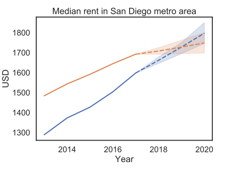
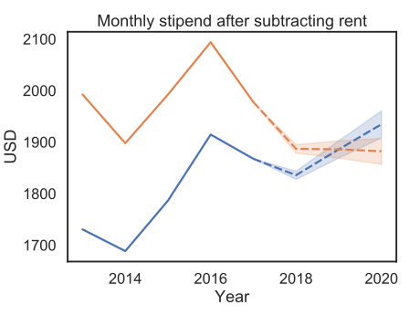
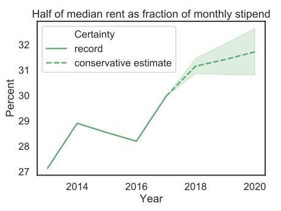

class: center, middle, inverse

# Challenges for the BISB program
January 13, 2020

[PDF version](bisb-challenges.pdf)
 
.footnote[View on [github](https://github.com/anthony-aylward/bisb-challenges). Slideshow created with [remark](https://github.com/gnab/remark) and [github pages](https://pages.github.com/).]

---

class: center, middle, inverse

# Part I
NIH budget plateau and increasing graduate enrollment

.footnote[Inspired by ["A fair deal for PhD students and postdocs"](https://elifesciences.org/articles/01139) (eLife, 2013)]

---

.left-column[
  ## NIH budget plateau
  ### - 1960-2014
]

.right-column[
  
  - After decades of continuous rapid growth, the budget of the NIH plateaued
    in the 2000's.
  
  .footnote[Image source: [Urban Wire](https://www.urban.org/urban-wire/nih-funding-crisis-really-biomedical-research-workforce-crisis) (2015)]
]

---

.left-column[
  ## NIH budget plateau
  ### - 1960-2014
  ### - 1994-2020
]

.right-column[
  
  - The budget has oscillated but effectively remained stagnant since 2002,
    and future growth is uncertain.

  .footnote[Image Source: [American Institute of Physics](https://www.aip.org/fyi/2019/fy20-budget-request-national-institutes-health) (2019)]
]

---

.left-column[
  ## NIH budget plateau
  ### - 1960-2014
  ### - 1994-2020
  ### - Future prospects
]

.right-column[
  Growth in the near term is likely to be slow at best in the face of an
  oncoming global recession:
  
  - [US economists expect recession in 2020 or 2021: Survey](https://www.aljazeera.com/ajimpact/economists-expect-recession-2020-2021-survey-190819072819514.html) (Al Jazeera, 2019)
  
  - [Global recession a serious danger in 2020, says UN](https://www.theguardian.com/business/2019/sep/25/global-recession-a-serious-danger-in-2020-says-un) (Guardian, 2019)
  
  - [3 out of 4 economists predict a U.S. recession by 2021, survey finds](https://www.washingtonpost.com/business/2019/08/19/out-economists-predict-us-recession-by-survey-finds/) (Washington Post, 2019)
  
  - [As Economists Forecast for 2020, Some Already Thinking Past the Next Recession](https://urbanland.uli.org/capital-markets/as-economists-forecast-for-2020-some-already-thinking-past-the-next-recession/) (Urban Land, 2019)
  
  - [The Predicted 2020 Global Recession](https://worldfinancialreview.com/the-predicted-2020-global-recession/) (World Financial Review, 2018)
]

---

.left-column[
  ## NIH budget plateau
  ### - 1960-2014
  ### - 1994-2020
  ### - Future prospects
  ### - Funding rates
]

.right-column[
  
  - Despite explosive budget growth in the 80's and 90's, the success rate of
    NIH grant applications has been in decline for the past three decades.
  
  .footnote[Image source: [Urban Wire](https://www.urban.org/urban-wire/nih-funding-crisis-really-biomedical-research-workforce-crisis) (2015)]
]

---

.left-column[
  ## NIH budget plateau
  ### - 1960-2014
  ### - 1994-2020
  ### - Future prospects
  ### - Funding rates
]

.right-column[
  
  
  - The success rate has levelled off in recent years but remains below 20%.

  .footnote[Image source: [NIH/NIAID](https://www.niaid.nih.gov/grants-contracts/see-success-and-funding-rates-new-pis) (2017)]
]

---

.left-column[
  ## NIH budget plateau
  ### - 1960-2014
  ### - 1994-2020
  ### - Future prospects
  ### - Funding rates
  ### - Consequences
]

.right-column[
  
  - It is likely that increased pressure on faculty to compete for scarcer
    funding will be transferred directly to increased pressure on students.
]

---

.left-column[
  ## Increasing graduate enrollment
  ### - Nationwide
]

.right-column[
  
  - Enrollment of graduate students in ["Biomedical Sciences"](https://report.nih.gov/nihdatabook/page/field-classification) on NIH funding has increased steadily over the past three decades.
  
  .footnote[Image source: [NIH Data Book](https://report.nih.gov/nihdatabook/category/20)]
]

---

.left-column[
  ## Increasing graduate enrollment
  ### - Nationwide
  ### - At UCSD
]

.right-column[
  
  - At UCSD, enrollment of doctoral students in  Biological Sciences, Health
    Sciences, and Jacobs School of Engineering has increased by over 30% since
    2010.
  
  .footnote[Image source: [UCSD Institutional Research](https://ir.ucsd.edu/grad/stats/enrollment.html)]
]

---

.left-column[
  ## Increasing graduate enrollment
  ### - Nationwide
  ### - At UCSD
  ### - In BISB
]

.right-column[
  
  - Enrollment in BISB has nearly doubled over the past decade.
  
  .footnote[Image source: [UCSD Institutional Research](https://ir.ucsd.edu/grad/stats/enrollment.html)]
]

---

.left-column[
  ## Increasing graduate enrollment
  ### - Nationwide
  ### - At UCSD
  ### - In BISB
  ### - Consequences
]

.right-column[

### National
- Increased [competition for research jobs](https://cen.acs.org/careers/postdocs/Future-US-biomedical-research-enterprise/96/i17)

- The ["postdoc holding tank"](https://elifesciences.org/articles/01139)

### University-level
- Increased competition for housing

### Program-level
- Increased competition for lab positions

- Increased competition for courses (CSE etc.)

- Increased workload for program staff (and students)
]

---

class: center, middle, inverse

# Part II
Financial challenges for students

---

.left-column[
  ## Financial challenges for students
  ### - Inflation and rent
]

.right-column[
- San Diego's inflation rate is very high, and rent is increasing even more
  rapidly. This includes university housing. Rents in Mesa Nueva apartments [increased by 5-6%](https://hdh.ucsd.edu/arch/docs/2019-20-rates-announcement.pdf) in 2019.

- [San Diego’s inflation rate among highest in nation](https://www.sandiegouniontribune.com/business/economy/story/2019-08-13/san-diegos-inflation-rate-among-highest-in-nation) (SDUT, 2019)

- [Report: San Diego rent profits predicted amid home affordability concerns](https://www.sandiegouniontribune.com/business/real-estate/story/2019-08-19/report-san-diego-rent-profits-predicted-amid-home-affordability-concerns) (SDUT, 2019)

- [UCSD hikes rent on campus housing, angering graduate students](https://www.sandiegouniontribune.com/news/education/story/2019-04-02/ucsd-hikes-rent-on-campus-housing-angering-graduate-students) (SDUT, 2019)

- San Diego was in the top 5 [Cities With the Most Extreme Increases in 2-Bedroom Apartment Rental Prices](https://www.apartmentguide.com/blog/two-bedroom-rent-increasing-decreasing-the-most/) (Apartment Guide, 2019)

- [It’s tough to be a renter in San Diego County](https://inewsource.org/2019/01/03/rent-cost-san-diego-apartment/) (inewsource, 2019)

- [San Diego rent hits all-time high](https://www.sandiegouniontribune.com/business/real-estate/sd-fi-rent-sept-20181009-story.html) (SDUT, 2018)
]

---

.left-column[
  ## Financial challenges for students
  ### - Inflation and rent
  ### - Stipend vs. inflation
]

.right-column[
  
  - BISB stipend has remained roughly level with inflation for the past six years.

  - Inflation corrections based on
    [CPI-U for San Diego-Carlsbad](https://data.bls.gov/timeseries/CUURS49ESA0)
    from the Bureau of Labor Statistics.

  .footnote[Data source: [BISB website](https://bioinformatics.ucsd.edu/node/18), [Wayback Machine Internet Archive](http://web.archive.org/web/*/https://bioinformatics.ucsd.edu/node/18)]
]

---

.left-column[
  ## Financial challenges for students
  ### - Inflation and rent
  ### - Stipend vs. inflation
]

.right-column[
  
  - Assuming 2.8% inflation (as in 2019), the inflation-adjusted stipend is
    about to drop to its lowest level since 2014.
]

---

.left-column[
  ## Financial challenges for students
  ### - Inflation and rent
  ### - Stipend vs. inflation
  ### - Rent vs. inflation
]

.right-column[
  
  - Median rent in San Diego has increased significantly every year.

  - The latest [Census ACS](http://www.census.gov/acs/www/) survey data is from 2017.
    Dashed lines represent a conservative estimate.
  
  .footnote[Data source: [Department of Numbers](https://www.deptofnumbers.com/rent/california/san-diego/)]
]

---

.left-column[
  ## Financial challenges for students
  ### - Inflation and rent
  ### - Stipend vs. inflation
  ### - Rent vs. inflation
]

.right-column[
  
  - The conservative estimate assumes a 3-5% increase per year. Note that [BLS data](https://fred.stlouisfed.org/series/CUUSA424SEHA) suggests rent in San Diego-Carlsbad increased by over 5% in 2018, and [SDUT reported](https://www.sandiegouniontribune.com/business/economy/story/2019-08-13/san-diegos-inflation-rate-among-highest-in-nation) a 4% increase in 2019.
  
  .footnote[Data source: [Department of Numbers](https://www.deptofnumbers.com/rent/california/san-diego/)]
]

---

.left-column[
  ## Financial challenges for students
  ### - Inflation and rent
  ### - Stipend vs. inflation
  ### - Rent vs. inflation
  ### - Stipend vs. rent
]

.right-column[
  
  - Shown: Monthly stipend minus 50% of median rent. In 2019 dollars, this
    value is currently at its lowest level since 2012 (or earlier).

  - After accounting for inflation and median rent, the buying power of a
    student enrolled in 2013 has declined by 5% (conservatively).
]

---

.left-column[
  ## Financial challenges for students
  ### - Inflation and rent
  ### - Stipend vs. inflation
  ### - Rent vs. inflation
  ### - Stipend vs. rent
]

.right-column[
  
  - Median rent as a fraction of the stipend has increased significantly in
    recent years, exceeding 30%.
  
  - [When residents pay more than 30 percent of income in housing costs, local economies suffer](https://www.sandiegouniontribune.com/business/real-estate/sdut-rent-wages-housing-concern-2016aug02-htmlstory.html). Residents paying more than this threshold are considered [rent burdened](https://www.huduser.gov/portal/pdredge/pdr_edge_featd_article_092214.html) by [HUD](https://www.hud.gov).
]

---

.left-column[
  ## Financial challenges for students
  ### - Inflation and rent
  ### - Stipend vs. inflation
  ### - Rent vs. inflation
  ### - Stipend vs. rent
  ### - Consequences
]

.right-column[
- Cost of living is a [significant challenge](https://ir.ucsd.edu/_files/GPSES_2017.pdf) to students' academic progress.

- Growing enrollment at UCSD will only drive local rents higher.

- A stipend increase to at least $34,000 is urgently needed.

- The stipend for Biomedical Sciences PhD students [is already $34,000](http://biomedsci.ucsd.edu/about/BMS%20Guidelines%2011-5-18.pdf).

- UCSD research funding has broken records year after year. The graduate students doing the research should see some benefit from this.

  - [UCSD pulls in $1.35B in research funding, shattering record](https://www.sandiegouniontribune.com/news/science/story/2019-10-07/uc-san-diego-shatters-record-for-research-funding-pulling-in-1-35-bi) (SDUT, 2019)

  - [UC San Diego Received $1.37 Billion in External Funding During Last Fiscal Year](https://ucsdnews.ucsd.edu/pressrelease/uc_san_diego_received_1.37_billion_in_external_funding_during_last_fiscal_year) (UCSD News Center, 2018)
]

---

.left-column[
  ## Financial challenges for students
  ### - Inflation and rent
  ### - Stipend vs. inflation
  ### - Rent vs. inflation
  ### - Stipend vs. rent
  ### - Consequences
]

.right-column[
- [The cost of housing in Santa Cruz](https://www.deptofnumbers.com/rent/california/santa-cruz/) has also risen sharply in recent years. At time of writing, UC Santa Cruz graduate
students are [on strike](https://www.santacruzsentinel.com/2019/12/09/ucsc-grad-students-strike-saying-they-will-withhold-grades-until-given-a-raise-to-afford-housing/) for a cost of living adjustment to their stipend.
    - The strike is supported by the [UCSC Faculty Association](http://ucscfa.org/2019/12/scfa-solidarity-with-graduate-students/), the [UC San Diego Graduate Student Association](https://payusmoreucsc.com/wp-content/uploads/2019/12/UC-San-Diego-GSA.pdf), [UC Davis grad students](https://payusmoreucsc.com/wp-content/uploads/2019/12/UC-Davis-Solidarity-Statement-12_10_19.pdf), [UC Santa Barbara grad students](https://payusmoreucsc.com/wp-content/uploads/2019/12/UC-Santa-Barbara-Statement-of-Solidarity.pdf), and [more](https://payusmoreucsc.com/statements-of-support/).
    - [Currently Santa Cruz grad assistants earn $2,434/mo before taxes, nine months per year](https://www.insidehighered.com/quicktakes/2019/12/10/uc-santa-cruz-grad-assistants-strike-cola), or $21,906/yr. They are seeking an increase to $3,846/mo, or $34,614/yr.

- Effective 2020, [the federal minimum salary threshold for overtime-exempt employees is $35,568](http://aps.ucsd.edu/compensation/apo-salary.html#Department-of-Labor-Overtime-Ru). Legally, this threshold [does not apply to graduate students](https://www.dol.gov/whd/overtime/whdfs17s.pdf)... for some reason.

- Setting the BISB stipend to a level less than $35,568 requires justification,
  because BISB students are workers in all but name.
]

---

class: center, middle, inverse

# Part III
Structural challenges for students

---

.left-column[
  ## Structural challenges for students
  ### - Rotations
]

.right-column[
There is a need to re-write the rotation guidelines.

### The match-making process
Here is an excerpt from BISB's
["Guidelines for Matching Students and PhD. Advisors"](https://bioinformatics.ucsd.edu/node/99):

> At the conclusion of the 3rd rotation, students and faculty can begin
> discussions about students joining labs, and about possible dissertation
> projects. However, prior to Spring quarter Finals week, while the Rotation
> Program is in process, such discussions are inappropriate, …. As such,
> overt recruiting prior to Spring quarter Finals week is not permitted under
> the Rotation Programs guidelines.

This guideline is misleading. In fact, students _must_ discuss both joining the
lab and at least the beginning of a thesis project with each potential advisor
_before_ agreeing to the rotation.

]

---

.left-column[
  ## Structural challenges for students
  ### - Rotations
]

.right-column[
There is a need to re-write the rotation guidelines.

### The match-making process
Students who wait until Spring quarter Finals week to discuss joining a lab are
in for an unpleasant surprise when they find out they may not be funded for the
summer.

A more appropriate guideline would be the following:

> Students should have discussions about joining labs, and about possible
> dissertation projects, with many faculty throughout their first year - even
> faculty they are not rotating with.

]

---

.left-column[
  ## Structural challenges for students
  ### - Rotations
]

.right-column[
There is a need to re-write the rotation guidelines.

### Summer rotations
Here is an email from the program chair to an inquisitive
student (Spring 2019):

> We have very limited funds to support for summer rotations, and this time, I
> want to correspond with the PIs in advance before we agree to fund the summer
> rotation.

This means it is critical for each student to join a lab _before_ the start of
their first summer session. The guidelines need to reflect the fact that
funding for summer rotations is not guranteed.

### Additional note
In some cases, rotation advisors take on students for the sake of getting 10
weeks free labor, with no intention of providing them a lab position. There is
a need for policies that discourage this behavior.

]

---

.left-column[
  ## Structural challenges for students
  ### - Rotations
  ### - Coursework vs. research
]

.right-column[
There is a need for guidelines on the amount of time students spend on
coursework vs. research, especially in the second year when they are funded
by their PI but still have classes to attend. The [UCSD-wide guideline](http://senate.ucsd.edu/media/276096/epc-credit-hour-policy-and-supplement.pdf) is three hours of work per credit per week.

- Currently, many students struggle to balance their required course workload
  with faculty expectations for their research projects.

- This places a burden on students' mental health.

> People have also jokingly commented to me “you signed up for this” or “if you’re going to do homework/assignments in lab, why don’t you just take easier classes?”

> It feels VERY VERY [unpleasant] to hear stuff like that.

- In some cases, faculty decline to take rotation students in certain quarters
  out of concern that heavy coursework will limit students' research
  productivity.
]

---

.left-column[
  ## Structural challenges for students
  ### - Rotations
  ### - Coursework vs. research
]

.right-column[
The BISB Steering Committee (SC) is looking into **alerting rotation advisors** that their students are taking courses, per recent correspondence:

> A good idea ... is that rotation advisors could be alerted that their rotation students are taking classes (and point to the curriculum on the website), so the rotation should be no more committment than any regular class during the quarter, and certainly not full time.

However, this is too little too late. Rotation advisors **should already** know what courses their students are taking. It is a failure of the program if prospective thesis advisors (who will be responsible for guiding a student through their PhD) do not even know the most basic program requirements.
]

---

.left-column[
  ## Structural challenges for students
  ### - Rotations
  ### - Coursework vs. research
  ### - Understaffing
]

.right-column[
- BISB coordinator role has high turnover (5 coordinators in 6 years).

- In 2018, the role went unfulfilled for several months, and this had a
  serious impact on the program. Administration issues resulted in:
  - Troubles ​registering for classes.
  - Tuition being paid late​ resulting in all classes being dropped for a
    student, fines/holds placed on accounts, ​and ​temporary loss of health insurance.
  - Trouble getting official approval for senate committee.
  - No responses about recruitment weekend until the week of.
  - See also the [2018 town hall survey results](bisb-bmi-town-hall-survey-summary-2018.pdf) for more info.

- While Jade's work has been very helpful, there is a need for a second
  coordinator to ensure reliable support for the increasing number of BISB
  students.

- Update: In Jan 2020, Jade will leave BISB for Rady School of Management.
]

---

class: center, middle, inverse

# Part IV
Mental health

---

.left-column[
  ## Mental Health
]

.right-column[
- The ongoing crisis of mental health issues among PhD students has been
  researched and discussed [extensively](https://anthony-aylward.github.io/mental-health/).
  BISB students are not immune to it.

- Each of the challenges discussed previously can impact students' mental health.

- [This column](https://thetech.com/2019/10/10/graduate-student-mental-health)
  written by graduate students at MIT discusses the impact of the mental health crisis. They offer two recommendations (relevant to UCSD & BISB as well) to better support the mental health of MIT students:
  - Improved mental health coverage and access
  - Accountability in advisor-advisee relations

- Distressing accounts from [Stanford](https://www.stanforddaily.com/2019/03/13/a-toxic-culture-of-overwork-inside-the-graduate-student-mental-health-crisis/)
and [Cornell](https://www.ipetitions.com/petition/msk-wcm-student-deaths?utm_source=whatsapp&utm_medium=social&utm_campaign=&loc=view-petition) illustrate the dire
(life-and-death) consequences of neglecting students' mental health.
]

---

class: center, middle, inverse

# Summary

---

.left-column[
  ## Summary
]

.right-column[
- At a national level, the plateauing NIH budget, growing population of new
  researchers, and low funding rates will increase pressure on PI's, and that
  pressure will likely be passed on to graduate students.

- Rapidly increasing inflation and rent in San Diego are outpacing growth of
  BISB student stipends.

- Structural problems with rotations, balancing coursework against
  research time, and understaffing are obstacles to degree progress for BISB
  students.

- The cost of neglecting these challenges will be an increased burden
  on the mental health of BISB students, which in turn will impact the
  scientific productivity of the program.
]

---

.left-column[
  ## Summary
]

.right-column[

For BISB and for UCSD in general, policies that effectively address these
challenges will be based on principles of:

 

 **Increased institutional support for students**

 

 **Decreased rate of new student enrollment**
]
